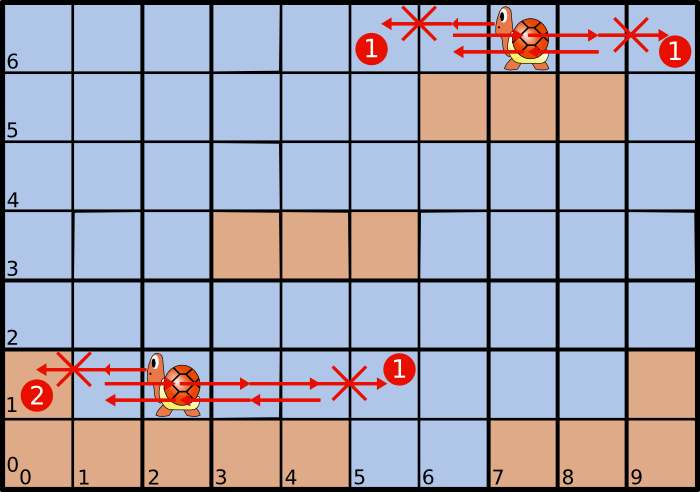
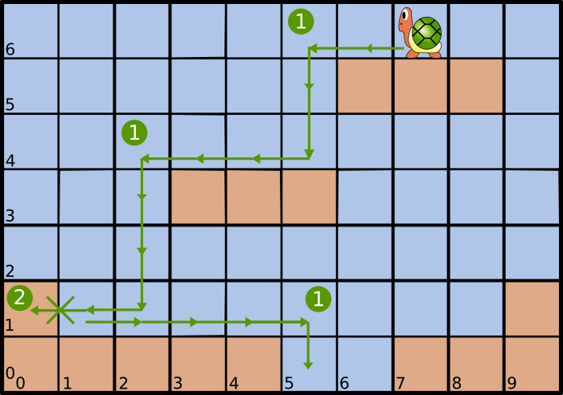

=======================================
    Dependently Typed Koopa Troopas
=======================================

Wat zijn dependent types?
=========================

De meeste programmeertalen hebben types, bijvoorbeeld voor gehele getallen en
voor vlottende-komma getallen.
Zulk een systeem kan ofwel sterk (statisch) ofwel zwak (dynamisch)
getypeerd zijn.
Programma's in statisch getypeerde talen kunnen niet gecompileerd worden
zonder dat alle typechecks slagen.
Programma's in dynamisch getypeerde talen daarentegen doen gewoon hun ding
tot er at runtime een typefout optreedt.
Dit klinkt natuurlijk goed: het programma kan werken, ook al is het technisch
gezien niet helemaal juist.
Maar de developer is vaak te ver verwijderd van zo'n
fout at runtime om ze gemakkelijk te kunnen oplossen.
In de praktijk wordt dit opgelost met uitgebreide testsuites, maar zelfs dan
is er eigenlijk nooit de garantie dat het programma volledig juist is.
We kunnen immers niet alle mogelijke combinaties van invoer nagaan.

Een voorbeeld van een statisch typesysteem is het typesysteem van Java.
Ook Haskell heeft statische types, ook al moeten we ze niet altijd schrijven
dankzij de type inferentie in het Hindley-Milner systeem.
Dependent types zijn een andere vorm van statische types.
Dit zijn types die kunnen afhangen van waardes (at runtime), bijvoorbeeld
de head functie [#head]_ is meestal onveilig: ze mag eigenlijk niet toegepast
worden op een lege lijst.
In een dependently typed taal kunnen we de lengte van lijsten bij in hun
type opnemen.
Dan kunnen we voor de head functie opleggen dat ze enkel werkt op lijsten met
een lengte verschillend van 0.
Dit soort lijsten noemt men gewoonlijk vectors.
Dit voorbeeld is hieronder uitgewerkt in de taal Agda [#agda]_:

    .. code-block:: agda
    
        data Vec (A : Set) : ℕ → Set where
          []  : Vec A zero
          _⸬_ : {n : ℕ} → A → Vec A n → Vec A (suc n)
        
        head : {A : Set}{n : ℕ} → Vec A (suc n) → A
        head (x ⸬ xs) = x 

Zoals we kunnen zien in het type van de head functie, werkt deze voor eender
welke vector met lengte *suc n*.
De opvolger van een willekeurig natuurlijk getal is altijd groter dan 0,
dus lege vectors zijn niet toegelaten als argument van de head functie.
Wat voor belang heeft dit nu?
In programma's met een onveilige head functie treedt er een fout op at runtime
wanneer ze wordt toegepast op een lege lijst.
Deze fout moet overal waar de functie gebruikt wordt, opgevangen worden.
Anders kan het programma crashen.
In een taal met dependent types kan je ervoor kiezen om statisch te garanderen
dat dit soort fouten zich nooit zal voordoen.
De prijs die je hiervoor betaalt is dat je types meer verboos worden.

Dependently typed Koopa Troopas
===============================

Om het nut van zulke statische verificatie duidelijker te maken heb ik een
uitgebreider voorbeeld uitgewerkt.
De meeste mensen kennen Mario wel, de dappere kleine loodgieter die het opneemt
tegen een legioen van onder meer paddestoelen en schildpadden om princes Peach
te redden van Bowser.
Die "schildpadden" zijn eigenlijk Koopa Troopas en ze komen in verschillende
kleuren en vormen voor.
Ik ga het hebben over de rode en de groene varianten.
De groene Koopa Troopas zijn tevens de bekendste.
Ze wandelen de hele tijd in dezelfde richting waarbij ze van platforms
afspringen zonder problemen, in tegenstelling tot hun rode variant.
Deze draaien om als ze aan het einde van een platform komen [#koopa]_.
Beide keren ze wanneer ze een muur tegenkomen.
De Mariospellen zijn ook gekend vanwege de vele glitches [#glitch]_ die
erin voorkomen, deze worden veroorzaakt door fouten in het spelprogramma.
Fouten die met statische verificatie vermeden zouden kunnen worden.

In het voorbeeld laat ik zien hoe we het type van de Koopa Troopas kunnen
gebruiken om ervoor te zorgen dat een rode Koopa Troopa nooit van een platform
af zal lopen.
Ik laat enkel de code voor het pad type zien omdat dit het belangrijkste deel
van de oplossing is [#github]_:

    .. code-block:: agda

        data Path {c : Color} (Koopa : KoopaTroopa c) :
             Position → Position → Set where
          []     : ∀ {p} → Path Koopa p p
          _↠⟨_⟩_ : {q r : Position} → (p : Position) → q follows p ⟨ c ⟩
                     → (qs : Path Koopa q r) → Path Koopa p r

Dit is een data declaratie, meer bepaald van een inductive family [#induct]_.
Inductive family's zijn een manier om een nieuw type te specifiëren [#adt]_.
Na het woord *data* geven we de naam van het type, in dit geval *Path*.
Daarna komen een aantal parameters.
Een algebraic data type lijkt op een een functie op het niveau van types,
dat is hier duidelijk te zien.
Na de dubbelepunt komt het type van het voorgaande stuk, hier het functietype
*Position → Position → Set*.
*Path* geparametriseerd met een *Color* en een *KoopaTroopa* is een functie
die twee *Position* argumenten nodig heeft
en dan een resultaat van het type *Set* geeft.
*Set* is in Agda het type van types [#kind]_, dus het resultaat van *Path* met
de juiste argumenten is een type.
Een concreet voorbeeld: *Path Red KT (0,0) (1, 0)*, waar *(0,0)* en *(1,0)*
representaties zijn van posities, zou een pad zijn voor een rode Koopa Troopa
van *(0,0)* naar *(1,0)*.

Een type is gewoonlijk niet nuttig als we er geen elementen van kunnen maken.
Daarom zijn er meestal een aantal constructors voor gedefinieerd.
De constructor *[]* maakt een leeg pad aan voor een Koopa Troopa van een
positie [#positie]_ naar diezelfde positie, een pad zonder stappen leidt naar
nergens.
De andere constructor heeft als (expliciete) argumenten: een positie,
een bewijs dat de eerste positie van een pad mag volgen op die positie voor
een bepaalde kleur van Koopa Troopa en een pad vertrekkend van de juiste
positie.
Het lege pad past aan het einde van eender welk ander pad dankzij het
impliciete positie-argument.
Omdat dit de enige manieren zijn om een pad op te stellen, weten we dat zolang
de *follows* relatie de juiste beperkingen oplegt, een rode Koopa Troopa nooit
van een platform af zal springen.

Om aan te tonen dat dit werkt, heb ik een aantal voorbeeldpaden opgesteld.
In figuren :num:`fig-red` en :num:`fig-green` zijn de legale en illegale
bewegingen grafisch weergegeven.

.. _fig-red:

    Bewegingen voor een rode Koopa Troopa

Het eerste pad gaat van positie *(7,6)* naar *(8,6)* en komt
ongeveer overeen met het getekende pad rechtsboven in figuur :num:`fig-red`.
De *p* is een functie om posities uit een matrix (het voorgedefinieerde level)
te halen, de *f* is een functie die een natuurlijk getal omzet in een getal met
een bovengrens (dit zorgt ervoor dat er nooit een out of bounds error kan
optreden).
Het tweede pad komt ongeveer overeen met het pad linksonder in
figuur :num:`fig-red`.

    .. code-block:: agda
    
        red_path_one : Path (Red KT) (p (f 7) (f 6)) (p (f 8) (f 6))
        red_path_one = p (f 7) (f 6) ↠⟨ back ⟩
                       p (f 6) (f 6) ↠⟨ next ⟩
                       p (f 7) (f 6) ↠⟨ next ⟩
                       p (f 8) (f 6) ↠⟨ stay ⟩ []
    
        red_path_two : Path (Red KT) (p (f 2) (f 1)) (p (f 3) (f 1))
        red_path_two = p (f 2) (f 1) ↠⟨ back ⟩
                       p (f 1) (f 1) ↠⟨ next ⟩
                       p (f 2) (f 1) ↠⟨ next ⟩
                       p (f 3) (f 1) ↠⟨ next ⟩
                       p (f 4) (f 1) ↠⟨ back ⟩
                       p (f 3) (f 1) ↠⟨ stay ⟩
                       []

De paden die kloppen zijn eigenlijk niet zo interessant in dit geval omdat we
verwachten dat die voldoen aan hun types.
Laten we dus eens kijken naar paden die niet kloppen.

    .. code-block:: agda

        red_nopath_one : Path (Red KT) (p (f 1) (f 1)) (p (f 0) (f 1))
        red_nopath_one = p (f 1) (f 1) ↠⟨ back ⟩
                         p (f 0) (f 1) ↠⟨ stay ⟩
                         []

Als we dit proberen type checken, krijgen we de volgende fout:

    .. code-block:: agda
    
        gas != solid of type Material
        when checking that the expression stay has type
        pos 0 (suc zero) gas Low follows p (f 0) (f 1) ⟨ Red ⟩

De type checker geeft dus een fout aan, de positie *(0,1)* is *solid*, het is
namelijk een muur, en een Koopa Troopa kan enkel *stay* uitvoeren op een
positie die *gas* is.
Oké, iedereen ziet wel dat een Koopa Troopa niet in een muur mag blijven staan
maar het loopt toch al eerder mis?
Een Koopa Troopa zou in de eerste plaats niet in een muur mogen lopen.
De reden dat de fout gevonden wordt op *stay* en niet op *back* is dat de
constructor die het pad opstelt (↠) rechts associatief is, het pad wordt dus
als het ware van achter naar voor opgesteld (en gecontroleerd), vandaar dat
de fout "te laat" gevonden wordt.
Hier is hetzelfde pad herhaald waar de eindpositie impliciet is:

    .. code-block:: agda

        red_nopath_two : Path (Red KT) (p (f 1) (f 1)) (p (f 0) (f 1))
        red_nopath_two = p (f 1) (f 1) ↠⟨ back ⟩ []

Deze keer maakt de fout wel duidelijk dat een rode Koopa Troopa geen muur in
kan lopen, in figuur :num:`fig-red` is dit aangeduid met een ⓶:

    .. code-block:: agda
    
        gas != solid of type Material
        when checking that the expression p (f 1) (f 1) ↠⟨ back ⟩ [] has
        type Path (Red KT) (p (f 1) (f 1)) (p (f 0) (f 1))

Nu de belangrijkste test nog, een rode Koopa Troopa zou niet van een platform
af mogen kunnen lopen, in figuur :num:`fig-red` is dit aangeduid met een
⓵:

    .. code-block:: agda

        red_nopath_three : Path (Red KT) (p (f 4) (f 1)) (p (f 5) (f 1))
        red_nopath_three = p (f 4) (f 1) ↠⟨ next ⟩ []

De fout geeft nu aan dat een rode Koopa Troopa geen "toestemming" heeft om van
een platform af te stappen:

    .. code-block:: agda
    
        Low != High of type Clearance
        when checking that the expression p (f 4) (f 1) ↠⟨ next ⟩ [] has
        type Path (Red KT) (p (f 4) (f 1)) (p (f 5) (f 1))

.. _fig-green:

    Bewegingen voor een Groene Koopa Troopa

Er zijn ook nog een aantal voorbeeldpaden met groene Koopa Troopas.
Dit eerste pad is hetzelfde als het eerste pad voor rode Koopa Troopas:

    .. code-block:: agda

        green_path_one : Path (Green KT) (p (f 7) (f 6)) (p (f 8) (f 6))
        green_path_one = p (f 7) (f 6) ↠⟨ back ⟩
                         p (f 6) (f 6) ↠⟨ next ⟩
                         p (f 7) (f 6) ↠⟨ next ⟩
                         p (f 8) (f 6) ↠⟨ stay ⟩ []

Zij die het spel kennen, zullen hier misschien vreemd van opkijken want een
Koopa Troopa mag eigenlijk niet terugdraaien zolang hij geen obstakel tegenkomt.
Als we deze eigenschap zouden willen verfiëren, zouden we ze ook in het type
voor een pad moeten opnemen natuurlijk.

Nu moeten we nog nakijken of ons type wel echt doet wat het moet doen,
we willen immers niet dat alle Koopa Troopas verhinderd worden om van platforms
af te springen, dit is het pad op figuur :num:`fig-green`, op de posities
aangeduid met een ⓵ springt de Koopa Troopa van een platform af:

    .. code-block:: agda
    
        green_path_two : Path (Green KT) (p (f 7) (f 6)) (p (f 5) (f 0))
        green_path_two = p (f 7) (f 6) ↠⟨ back ⟩
                         p (f 6) (f 6) ↠⟨ back ⟩
                         p (f 5) (f 6) ↠⟨ fall ⟩
                         p (f 5) (f 5) ↠⟨ fall ⟩
                         p (f 5) (f 4) ↠⟨ back ⟩
                         p (f 4) (f 4) ↠⟨ back ⟩
                         p (f 3) (f 4) ↠⟨ back ⟩
                         p (f 2) (f 4) ↠⟨ fall ⟩
                         p (f 2) (f 3) ↠⟨ fall ⟩
                         p (f 2) (f 2) ↠⟨ fall ⟩
                         p (f 2) (f 1) ↠⟨ back ⟩
                         p (f 1) (f 1) ↠⟨ next ⟩
                         p (f 2) (f 1) ↠⟨ next ⟩
                         p (f 3) (f 1) ↠⟨ next ⟩
                         p (f 4) (f 1) ↠⟨ next ⟩
                         p (f 5) (f 1) ↠⟨ fall ⟩
                         []

Een groene Koopa Troopa kan dus wel degelijk van platforms afspringen.
Het laatste pad laat nog zien dat groene Koopa Troopas nog steeds niet in
muren kunnen lopen, in figuur :num:`fig-green` aangeduid met een ⓶:

    .. code-block:: agda

        green_nopath_one : Path (Green KT) (p (f 1) (f 1)) (p (f 0) (f 1))
        green_nopath_one = p (f 1) (f 1) ↠⟨ back ⟩ []

Met als fout:

    .. code-block:: agda
    
        gas != solid of type Material
        when checking that the expression p (f 1) (f 1) ↠⟨ back ⟩ [] has
        type Path (Green KT) (p (f 1) (f 1)) (p (f 0) (f 1))

--------------------

Dit was een heel beperkt voorbeeld van wat we kunnen doen met dependent types.
Momenteel zijn er nog geen performante programmeertalen die dependent types
hebben, maar in de toekomst wordt het belangrijker om geverifiëerde code te
kunnen schrijven en dependent types bieden hier een oplossing.

.. rubric:: Footnotes

.. [#head] De head functie geeft het eerste element van een lijst terug,
           dit is typisch een functie die men in functionele talen terugvindt,
           wat te danken is aan de recursieve structuur van lijsten in die
           talen. 
.. [#agda] Agda is een functionele taal met dependent types en een goed begin
           voor zij die geïnteresseerd zijn om zo'n taal uit te proberen.
           Dit artikel is een goed uitgangspunt: "Dependently Typed Programming
           in Agda, Ulf Norell and James Chapman."
.. [#koopa] In sommige spellen is er een ander verschil tussen de varianten.
.. [#glitch] In dit filmpje is te zien hoe iemand een fout in de code voor
             Koopa Troopas uitbuit om over de vlag aan het einde van het eerste
             level te springen: http://youtu.be/dzlmNdP-ApU
.. [#github] Voor zij die geïnteresseerd zijn, de volledige code voor het
             voorbeeld is hier beschikbaar: https://github.com/toonn/popartt
.. [#induct] Denk als voorbeeld aan de definitie van de natuurlijke getallen:
             0 is een natuurlijk getal en de opvolger van een natuurlijk getal
             is een natuurlijk getal.
             Hiermee zijn de natuurlijke getallen volledig gedefinieerd.
.. [#adt] Haskell heeft algebraic data types, inductive families zijn algemener.
          GHC heeft ook een generalized algebraic data type extensie die
          gelijkaardig is aan inductive families.
.. [#kind] In type theory is dit normaal gekend als *kind* (* in Haskell).
           Als kind het type van een type is, wat is dan het type van een kind?
           In Agda is het type van een type *Set*, wat een afkorting is voor
           *|Set0|*, het type van *Set* is *|Set1|*.
           Dit kan natuurlijk niet oneindig ver doorgaan maar dit zou ons te
           ver leiden.
.. [#positie] Deze positie wordt impliciet gevonden uit het gebruik van de *[]*
              constructor; accolades worden in Agda gebruikt om impliciete
              argumenten aan te geven.
              Op de Agda wiki is hier meer over te vinden:
              http://wiki.portal.chalmers.se/agda/pmwiki.php?n=Docs.ImplicitArguments

.. |Set0| replace:: Set\ :sub:`0`
.. |Set1| replace:: Set\ :sub:`1`

